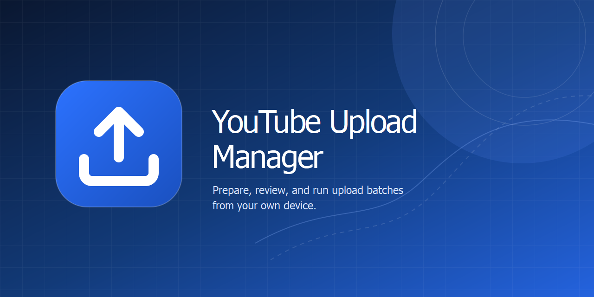

# YouTube Upload Manager



[](https://v2.tauri.app/)
[](https://react.dev/)
[](https://www.typescriptlang.org/)
[](https://www.rust-lang.org/)
[](LICENSE)

A straightforward desktop app for uploading videos to your YouTube channel,
checking for duplicates, and keeping control of your library — all from your
own device.

No technical setup is needed to get familiar with the app: choose your videos,
review their upload settings, and approve the actions you want it to take.
When you are ready to connect YouTube, the app walks you through the one-time
account setup using a Google Cloud project you control.

The application has no service-side queue, media store, or analytics pipeline.
Its only network activity is the Google and YouTube operation you explicitly
authorize and start.

## Capabilities

- Import videos into a persistent, device-local workspace and queue.
- Recover interrupted imports and resumable uploads from saved checkpoints.
- Connect an operator-authorized YouTube channel through installed-app OAuth.
- Upload private videos directly to YouTube from the native application.
- Sync the channel library locally and review explainable duplicate candidates.
- Create typed-ID deletion requests, then cancel or separately authorize them.

## Quick start

1. Install a current [Node.js](https://nodejs.org/) release and
   [Rust](https://www.rust-lang.org/tools/install).
2. Install the desktop prerequisites for your platform from the
   [Tauri setup guide](https://v2.tauri.app/start/prerequisites/).
3. Install dependencies and run the native app:

   ```sh
   npm install
   npm run tauri -- dev
   ```

4. Create a Google Cloud project you control, enable the YouTube Data API,
   configure its OAuth consent screen, and create a **Desktop app** OAuth
   client. Download that client's JSON, then import it from the app's
   connection panel before connecting a YouTube channel you are authorized to
   manage.

Useful local checks:

```sh
npm run check
npm run test
npm run build
```

## Documentation

- [Project home](docs/index.md)
- [Privacy policy](docs/privacy.md)
- [Terms of service](docs/terms.md)
- [Google OAuth for installed apps](https://developers.google.com/identity/protocols/oauth2/native-app)
- [YouTube Data API](https://developers.google.com/youtube/v3)

## Status

The local app, persistent queue, native OAuth path, resumable-upload workflow,
inventory sync, and deletion-request review are implemented and locally tested.
Live YouTube verification is intentionally separate: it requires an operator's
authorized test channel.

## Safety and security

OAuth credentials and upload checkpoints are handled by the native layer and
kept out of the webview. The queue, managed media, local inventory, and audit
records stay on the device. Deletion is never automatic: an operator must
select the video, type its exact ID, and pass a fresh authorization and
ownership check before a YouTube delete operation can occur.

This project uses official Google OAuth and YouTube APIs only. It does not
bypass account restrictions, quotas, copyright rules, or YouTube policies.

## Independent project and trademarks

YouTube Upload Manager is an independent project. It is not affiliated with,
endorsed by, sponsored by, or provided by Google or YouTube. Google and YouTube
are trademarks of Google LLC. All other product names, logos, and trademarks
are the property of their respective owners.

## Maintainers

Repository-specific contributor guidance is in [AGENTS.md](AGENTS.md). Internal
project context is maintained in [memory-bank/](memory-bank/README.md).

## License

Licensed under the [GNU Affero General Public License v3.0 or later](LICENSE).
Copyright (C) 2026 Satoshi Katade. See [NOTICE](NOTICE) for the project
copyright, trademark, and attribution notice.
